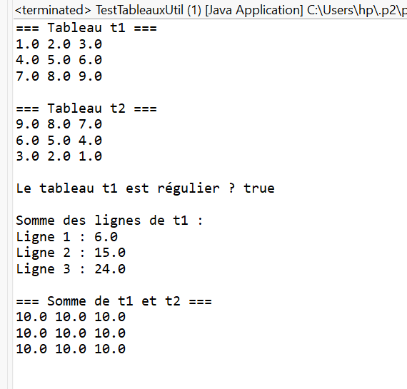

# TP3 — Boucles & Tableaux en Java

##  Description
Ce projet regroupe les **exercices du TP3** du module  
**Fondamentaux et Concepts Avancés de la Programmation Java**.  
Chaque exercice illustre un concept important des **boucles**, **tableaux**, et **manipulations de matrices**.

---
##  Structure du projet
```
TP3/
│
├── src/
│ ├── serieharmonique/
│ │ └── Ex1SerieHarmonique.java
│ │ └── ex1.PNG
│ ├── triangleetoiles/
│ │ └── Ex2TriangleEtoiles.java
│ │ └── EX2.PNG
│ ├── carresimpairs/
│ │ └── Ex3CarresImpairs.java
│ │ └── EX3.PNG
│ ├── tableauxutil/
│ │ ├── Ex4TableauxUtil.java
│ │ └── TestTableauxUtil.java
│ │ └── EX4.PNG
│ ├── rotationmatrice/
│ │ └── Ex5RotationMatrice.java
│ │ └── EX5.PNG
│ └── fenetreglissante/
│ └── Ex6FenetreGlissanteDistinct.java
│ └── EX6.PNG
└── README.md
```

---

## 🧠 Exercices inclus

### 🔹 Exercice 1 — Série Harmonique
Calcul de la somme des `n` premiers termes de la série harmonique :
> 1 + 1/2 + 1/3 + ... + 1/n

 ##  Exemple d’exécution (image)
 
Voici un exemple de l'exécution du programme (screenshot) : 


---

### 🔹 Exercice 2 — Triangle d'Étoiles
Affichage d’un triangle isocèle formé d’étoiles `*` aligné à gauche.

 ##  Exemple d’exécution (image)
 
Voici un exemple de l'exécution du programme (screenshot) : 


---

### 🔹 Exercice 3 — Carrés des Nombres Impairs
Création et affichage d’un tableau contenant les carrés des `n` premiers nombres impairs.

 ##  Exemple d’exécution (image)
 
Voici un exemple de l'exécution du programme (screenshot) : 


---

### 🔹 Exercice 4 — Classe utilitaire pour Tableaux 2D
Classe proposant :
- Affichage d’un tableau 2D  
- Vérification de la régularité  
- Calcul des sommes par ligne  
- Somme de deux matrices régulières
  
 ##  Exemple d’exécution (image)
 
Voici un exemple de l'exécution du programme (screenshot) : 



---

### 🔹 Exercice 5 — Rotation d’une Matrice
Rotation **en place** d’une matrice carrée `N×N` de 90° dans le sens horaire (sans tableau supplémentaire).

 ##  Exemple d’exécution (image)
 
Voici un exemple de l'exécution du programme (screenshot) : 


---

### 🔹 Exercice 6 — Fenêtre Glissante
Calcul du **nombre de valeurs distinctes** dans chaque fenêtre de taille `k` d’un tableau, en **O(n)**.

 ##  Exemple d’exécution (image)
 
Voici un exemple de l'exécution du programme (screenshot) : 


---


##  Auteur
**Salma Lakhal**  
École Normale Supérieure de Marrakech  
> Module : Fondamentaux et Concepts Avancés de la Programmation Java  
> Année : 2025  

---

###  Merci d’avoir consulté ce projet !

